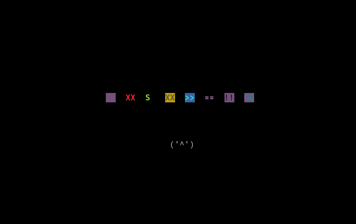

# VVVVVV風ゲーム
高専3年のC言語の授業課題で制作したCUIゲームです。
[TerryCavanagh/VVVVVV](https://github.com/TerryCavanagh/VVVVVV) のオマージュです。
初めて制作した大規模プログラムで、家に持ち帰って熱心に作り込んだ思い出があります。

## ストーリー
    宇宙旅行をしていたあなたたち。
    ある星に着陸するときにトラブルが発生！
    仲間とはぐれてしまい、不思議な洞窟に迷い込んでしまった...。

## スクリーンショット




## 操作方法
- [ <- ]  :   右へ移動します。
- [ -> ]  :   左へ移動します。
- [Space] :   重力反転をします。
- [ m ] :   メニューを開きます。

## 実行方法
### ローカル上
```sh
$ git pull https://github.com/K-Gamma/vvvvvv.git
$ cd vvvvvv
$ make
$ ./vvvvvv
```

### Dockerコンテナ上
```sh
$ docker pull kgamma/vvvvvv
$ docker run -itd --name vvvvvv kgamma/vvvvvv:latest
$ docker exec -it vvvvvv /bin/bash -c "cd /workdir/vvvvvv && ./vvvvvv"
```

## 依存関係
- ncurses
  ```
  $ sudo apt install libncurses-dev
  ```

## 動作確認環境
- Ubuntu 20.04
- gcc 9.3.0
- libncurses-dev 6.2